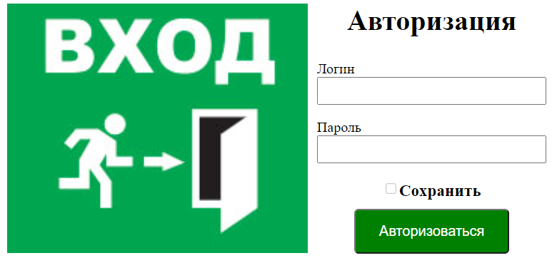
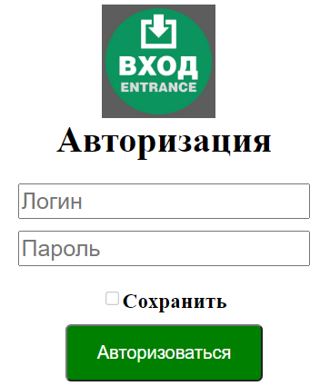

<p align = center>МИНИСТЕРСТВО НАУКИ И ВЫСШЕГО ОБРАЗОВАНИЯ

<p align = center>РОССИЙСКОЙ ФЕДЕРАЦИИ

<p align = center>ФЕДЕРАЛЬНОЕ ГОСУДАРСТВЕННОЕ БЮДЖЕТНОЕ ОБРАЗОВАТЕЛЬНОЕ УЧРЕЖДЕНИЕ ВЫСШЕГО ОБРАЗОВАНИЯ

<p align = center>«ВЯТСКИЙ ГОСУДАРСТВЕННЫЙ УНИВЕРСИТЕТ»

<p align = center>Институт математики и информационных систем

<p align = center>Факультет автоматики и вычислительной техники

<p align = center>Кафедра систем автоматизации управления

<p align = right>Дата сдачи на проверку:

<p align = right>«___» __________ 2022 г.

<p align = right>Проверено:

<p align = right>«___» __________ 2022 г.

<p align = center>Отчет по лабораторной работе № 2

<p align = center>по дисциплине

<p align = center>«Web-программирование»

<p align = center>Вариант 2


<p align = center>Разработал студент гр. ИТб-2301-01-00 ________________ /Ведерников Д.М./

<p align = center>Проверил ст. преподаватель _________________ /Земцов М.А./

<p align = center>Работа защищена с оценкой «___________» «___» __________ 2022 г.


<p align = center>Киров 2022

__________
Цель:  отобразить на странице адаптивный блок авторизации

Задачи:

1. Организовать процесс работы над лабораторной работой
1. Отобразить блок авторизации на странице

Ход выполнения:

1. Организовать процесс работы над лабораторной работой

Для работы в репозитории *[ссылка на репозиторий](https://github.com/Dementoriy/Web)* на сайте github.com от ветки lab1 создана новая ветвь с названием lab2. Cоздан Vue проект c названием Registration. В этом проекте был добавлен компонент Registration.vue.

2. Отобразить блок авторизации на странице

В ходе выполнения работы был реализован блок регистрации для компьютерной версии сайта, который содержит в себе: большой логоти, который распологается слева, название, два поля ввода для логина и пароля, checkBox для сохранения введенных данных и кнопку авторизации. Отображаемый на странице блок авторизации представлен на рисунке 1.

<p align=center></p>

<p align = center>Рисунок 1 – Блок регистрации для компьютерной версии сайта

Для мобильной версии сайта на странице присутствуют все те же компоненты, что и для компьютерной, но с некоторыми отличиями: маленький логотип, расположенный сверху, подсказки для полей ввода выполнены с помощью атрибута placeholder. Блок авторизации для мобильных устройств отображен на рисунке 2.


<p align=center></p>

<p align = center>Рисунок 2 – Блок регистрации для мобильной версии сайта

Листинг компонента Registration.vue представлен в приложении А.

Вывод: в ходе лабораторной работы организовано рабочее пространство, закреплены навыки работы с веб-фреймворком VUE. Также были освежены знания языков разметки html и css. На практике реализован адаптивный блок авторизации.

<p align = center>2

__________

<p align = center>Приложение А

<p align = center>(обязательное) 

<p align = center>Листинг компонента Registration.vue

```html
<template>
<div class="container">
  <div class="logo">
    
    
  </div>
  <div class="registration_block">
    <h1 class="title">Авторизация</h1>
    <div class="input_desctop">
      <div class="input-block">
        <p>Логин</p>
        <input type="text">
      </div>
      <div class="input-block">
        <p>Пароль</p>
        <input type="password">
      </div>
    </div>
    <div class="input-mobil">
      <input type="text" placeholder="Логин">
      <input type="password" placeholder="Пароль">
    </div>
    <div class="save">
      <input type="checkbox">
      <h3 class="save-text">Сохранить</h3>
    </div>
    <div>
      <button type="button" class="Enter-btn">Авторизоваться</button>
    </div>
  </div>
</div>
</template>

<script lang="ts">
export default {
};
</script>
<style scoped>
  .container{
    width: 100%;
    margin: 0 auto;
   display: flex;
    justify-content: center;
  }
```
<p align = center>3

__________

```css
  .logo{
    margin-right: 10px;
  }
  .biglogo-img{
    height: 280px;
  }
  .logo-img{
    display: none;
  }
  .registration_block{
    display: flex;
    align-items: center;
    flex-direction: column;
  }
  .title{
    margin-top: 0;
    margin-bottom: 10px;
  }
  .Enter-btn{
    background-color: green;
  }
  .save{
    display: flex;
    margin: 20px 0px 10px 0px;
  }
  .save-text{
    margin: 0 auto;
    margin-left: -1px;
  }
  .save input{
    cursor: pointer;
  }
  .Enter-btn{
    padding: 14px 26px;
    border-radius: 5px;
    font-size: 16px;
    color: white;
    cursor: pointer;
  }
  .input-mobil{
    display: none;
    flex-direction: column;
  }
  .input-block p{
      margin-bottom: 0px;
  }
  .input-block input{
    font-size: 20px;
    text-decoration: none;
    padding: 2px 1px;
    }

```
<p align = center>4

__________

```css

  @media (max-width:600px){
    .container{
      display: block;
    }
    .biglogo-img{
      display: none;
    }
    .logo-img{
      display: block;
      margin: 0 auto;
      height: 100px;
    }
    .input_desctop{
      display: none;
    }
    .input-mobil{
      display: flex;
    }
    .input-mobil input{
      margin-top: 10px;
    }
    .input-mobil input{
    font-size: 20px;
    text-decoration: none;
    padding: 2px 1px;
    }
  }
    @media (max-width:260px){
      .input-mobil input{
        width: 180px;
    }
    }
</style>
```