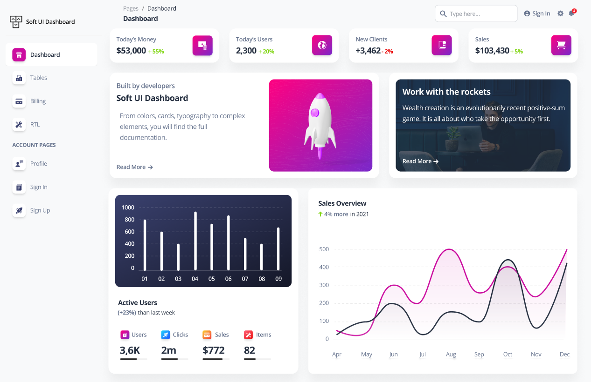
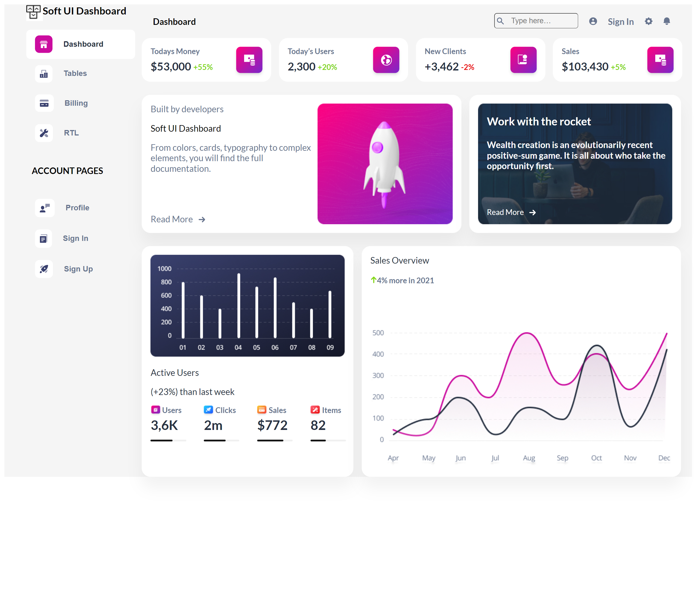
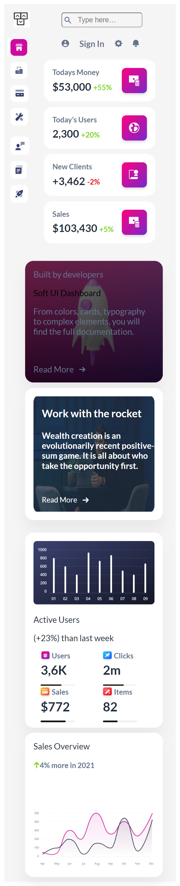

<p align = center>МИНИСТЕРСТВО НАУКИ И ВЫСШЕГО ОБРАЗОВАНИЯ

<p align = center>РОССИЙСКОЙ ФЕДЕРАЦИИ

<p align = center>ФЕДЕРАЛЬНОЕ ГОСУДАРСТВЕННОЕ БЮДЖЕТНОЕ ОБРАЗОВАТЕЛЬНОЕ УЧРЕЖДЕНИЕ ВЫСШЕГО ОБРАЗОВАНИЯ

<p align = center>«ВЯТСКИЙ ГОСУДАРСТВЕННЫЙ УНИВЕРСИТЕТ»

<p align = center>Институт математики и информационных систем

<p align = center>Факультет автоматики и вычислительной техники

<p align = center>Кафедра систем автоматизации управления
<pre></pre>
<pre></pre>
<pre></pre>

<p align = right>Дата сдачи на проверку:

<p align = right>«___» __________ 2022 г.

<p align = right>Проверено:

<p align = right>«___» __________ 2022 г.

<p align = center>Отчет по лабораторной работе № 4

<p align = center>по дисциплине

<p align = center>«Web-программирование»


<p align = center>Разработал студент гр. ИТб-2301-01-00 ________________ /Ведерников Д.М./

<p align = center>Проверил ст. преподаватель _________________ /Земцов М.А./

<p align = center>Работа защищена с оценкой «___________» «___» __________ 2022 г.


<p align = center>Киров 2022

<hr>
Цель:  сверстать макета с помощью фреймворка Vue

Задачи:

1. Организовать процесс работы над лабораторной работой
1. Выбрать dashboard-макет в Figma Community
1. Сверстать dashboard-страницу, разбив её на компоненты Vue
1. Реализовать адаптивную верстку под мобильное устройство

Ход выполнения:

1. Организовать процесс работы над лабораторной работой

Для работы в репозитории *[ссылка на репозиторий](https://github.com/Dementoriy/Web)* на сайте github.com была создана новая ветвь с названием lab4. В проект были добавлены компоненты App.vue, Header.vue, SideBar.Vue, Dashbord.vue. Листинг компоненита App.vue представлен в приложении А.

2. Выбрать dashboard-макет в Figma Community

На электронном ресурсе с готовыми макетами Figma Community был выбран макет, представленный на рисунке 1.


<p align=center></p>

<p align = center>Рисунок 1 – Dashboard-макет 

3. Сверстать dashboard-страницу, разбив её на компоненты Vue

В ходе выполнения работы были выделены логические компоненты макета, а именно: Header, SideBar, Dashbord. Листинги компонентов представлены в приложении Б, приложении В и приложении Г соответственно.

Реализованный макет представлен на рисунке 2.

<p align=center></p>

<p align = center>Рисунок 2 – Dashboard-макет для Desctop

<p align = center>2
<hr>

4. Реализовать адаптивную верстку под мобильное устройство

С помощью медиа запросов была реализована способность страницы адаптироваться под мобильные устройства. Результат продемонстрирован на рисунке 3.

<p align=center></p>

<p align = center>Рисунок 2 – Dashboard-макет для мобильных устройств

Вывод: в ходе лабораторной работы были закреплены навыки работы с фреймворком Vue. Реализован Dashboard-макет для компьютеров и мобильных устройств. 

<p align = center>3
<hr>


<p align = center>Приложение А

<p align = center>(обязательное) 

<p align = center>Листинг компонента App.vue

```html
    <template>
  <div class="conteiner">
    <SideBar class="SideBar"/>
    <div class="block">
      <Header class="Header"/>
      <Dashboard class="Dashboard"/>
    </div>
  </div>
</template>
<style scroped>
  .conteiner{
    display: flex;
    width: 100%;
    background-color: #F5F5F5;
    font-family: 'Lato', sans-serif;
  }
  .SideBar{
    width: 20%;
  }
  .block{
    width: 80%;
  }
  .Header{
    width: 100%;
  }
</style>
<script lang="ts">
import Vue from 'vue';
import axios from 'axios';
import Header from '../../header/src/components/Header.vue';
import SideBar from '../../sideBar/src/components/SideBar.vue';
import Dashboard from '../../dashboard/src/components/Dashboard.vue';
const url = 'http://localhost:8080/admission/';
export default {
  name: 'App',
  props: {
    results: [],
  },
  components: {
    Header,
    SideBar,
    Dashboard,
  },
  mounted() {
    axios
      .get(url)
      .then((response) => {
        console.log(response);
        this.results = response.data;
      })
      .catch((error: any) => console.log(error));
  },
};
</script>
```
<p align = center>3
<hr>

<p align = center>Приложение Б

<p align = center>(обязательное) 

<p align = center>Листинг компонента Header.vue

```html
<template>
  <div>
    <nav class="header">
      <h4>Dashboard</h4>
      <div class="navBarPanel">
        <input type="text" placeholder="Type here…" class="mr20">
        <div class="navigation">
          
          <h4 class="mr20">Sign In</h4>
          
          
        </div>
      </div>
    </nav>
  </div>
</template>

<script lang='ts'>
import Vue from 'vue';
export default {
};
</script>

<style scoped>
  .header{
    max-width: 96%;
    display: flex;
    margin: 0 auto;
    justify-content: space-between;
  }
  .navBarPanel{
    display: flex;
  }
  .navigation{
    display: flex;
  }
  .mr20{
    margin-right: 20px;
  }
  .navBarPanel input{
    width: 120px;
    height: 24px;
    margin-top: 16px;
    border-radius: 5px;
    border-width: 1px;
    background: url(../assets/Search.svg) no-repeat;
    background-size: auto 50%;
    background-position-y: 7px;
    background-position-x: 4px;
    padding-left: 30px;
  }
  .navBarPanel h4{
    font-size: 16px;
    color: #67748E;
  }
  @media (max-width: 420px)
  {
    nav h4:nth-child(1)
    {
      display: none;
    }
    .navBarPanel{
    display: block;
    margin: auto;
  }
  }
</style>
```
<p align = center>4
<hr>

<p align = center>Приложение В

<p align = center>(обязательное) 

<p align = center>Листинг компонента SideBar.vue

```html
    <template>
  <div>
    <header>
      
      <h3 class="m0">Soft UI Dashboard</h3>
    </header>
    <main>
      <ul>
        <li class="BGW-li">
          <button type="button" class="btnCheck" id="Dashboard" v-on:click="clickSideBar">
            
            <h4 class="m0">Dashboard</h4>
          </button>
        </li>
        <li class="BGG-li">
          <button type="button" class="btnUncheck" id="Tables" v-on:click="clickSideBar">
            
            <h4 class="m0">Tables</h4>
          </button>
        </li>
        <li class="BGG-li">
          <button type="button" class="btnUncheck" id="Billing" v-on:click="clickSideBar">
            
            <h4 class="m0">Billing</h4>
          </button>
        </li>
        <li class="BGG-li">
          <button type="button" class="btnUncheck" id="RTL" v-on:click="clickSideBar">
            
            <h4 class="m0">RTL</h4>
          </button>
        </li>
        <li>
          <h4>ACCOUNT PAGES</h4>
        </li>
        <li class="BGG-li">
          <button type="button" class="btnUncheck">
            
            <h4 class="m0">Profile</h4>
          </button>
        </li>
        <li class="BGG-li">
          <button type="button" class="btnUncheck">
            
            <h4 class="m0">Sign In</h4>
          </button>
        </li>
        <li class="BGG-li">
          <button type="button" class="btnUncheck">
            
            <h4 class="m0">Sign Up</h4>
          </button>
        </li>
      </ul>
    </main>
  </div>
</template>

<script lang='ts'>
import Vue from 'vue';
import Header from '../../../header/src/components/Header.vue';
const Dashboard = document.getElementById('Dashboard');
const Tables = document.getElementById('Tables');
const Billing = document.getElementById('Billing');
const RTL = document.getElementById('RTL');
const CurrentCheck = Dashboard;
export default {
  methods: {
    clickSideBar(e) {
      console.log(e.target.class);
    },
  },
};
</script>

<style scroped>
  header{
    display: flex;
    margin-left: 40px;
  }
  header img{
    height: 30px;
    width: 30px;
  }
  .m0{
    margin: 0;
  }
  main ul{
    list-style-type: none;
  }
  main li{
    width: 80%;
    display: flex;
    align-items: center;
    padding: 10px 20px 10px 10px;
    border-radius: 8px;
  }
  main li button{
    width: 34px;
  }
  main li h4{
      white-space: nowrap;
    }
  .BGW-li{
    background-color: #ffff;
  }
  .BGG-li{
    background-color: #F5F5F5;
  }
  .bgp{
    background-color: #CB0C9F;
    padding: 9px;
    border-radius: 8px;
  }
  .bgw{
    background-color: #fff;
    padding: 9px;
    border-radius: 8px;
  }
  .mr20{
    margin-right: 20px;
  }
  .btnCheck{
    background-color:#ffff;
    border: none;
    cursor: pointer;
    display: flex;
    align-items: center;
    font-size: 14px;
    color: #252F40;
  }
  .btnUncheck{
    background-color: #F5F5F5;
    border: none;
    cursor: pointer;
    display: flex;
    align-items: center;
    font-size: 14px;
    color: #67748E;
  }
  @media (max-width: 420px)
  {
    header{
      margin-left: 2%;
      margin-top: 14px;
    }
    main li h4{
      display: none;
    }
    header h3{
      display: none;
    }
    header img{
      display:block;
      margin:auto;
    }
    main ul{
      padding-left: 2%;
    }
    main li{
    padding: 5px;
  }
  .mr{
    margin: 0;
  }
  .BGW-li{
    background-color: #F5F5F5;
  }
  }
</style>
```
<p align = center>Приложение Г

<p align = center>(обязательное) 

<p align = center>Листинг компонента Dashbord.vue

```html
    <template>
  <div>
    <div class="cards">
      <div class="card df jc-sb">
        <div class="card-text">
          <h4 class="card-title">Todays Money</h4>
          <div class="card-info df jc-sb">
            <h3>$53,000</h3>
            <h5>+55%</h5>
          </div>
        </div>
        <div class="card-img">
          
        </div>
      </div>
      <div class="card df jc-sb">
        <div class="card-text">
          <h4 class="card-title">Today’s Users</h4>
          <div class="card-info df jc-sb">
            <h3>2,300</h3>
            <h5>+20%</h5>
          </div>
        </div>
        <div class="card-img">
          
        </div>
      </div>
      <div class="card df jc-sb">
        <div class="card-text">
          <h4 class="card-title">New Clients</h4>
          <div class="card-info df jc-sb">
            <h3>+3,462</h3>
            <h5 style="color: #EA0606">-2%</h5>
          </div>
        </div>
        <div class="card-img">
          
        </div>
      </div>
      <div class="card df jc-sb">
        <div class="card-text">
          <h4 class="card-title">Sales</h4>
          <div class="card-info df jc-sb">
            <h3>$103,430</h3>
            <h5>+5%</h5>
          </div>
        </div>
        <div class="card-img">
          
        </div>
      </div>
    </div>
    <div class="Banners">
      <div class="banner df jc-sb b60 bg-b1">
        <div class="banner-text">
          <p>Built by developers</p>
          <p>Soft UI Dashboard</p>
          <p style="hyphens: auto">From colors, cards, typography to complex elements, you
             will find the full documentation.</p>
          <div class="ReadMore df" style="color: #67748E">
            <p>Read More</p>
            
          </div>
        </div>
        <div class="banner-img">
          
        </div>
      </div>
      <div class="banner df jc-sb b40">
        <div class="banner2">
          <h3 style="font-size: 20px">Work with the rocket</h3>
          <h4 style="font-size: 16px">Wealth creation is an evolutionarily recent positive-sum game.
            It is all about who take the opportunity first.</h4>
          <div class="ReadMore df" style="color: white">
            <p>Read More</p>
            
          </div>
        </div>
      </div>
    </div>
    <div class="Statistick">
      <div class="banner stat-banner b40">
        
        <p>Active Users</p>
        <p>(+23%) than last week</p>
        <div class="statisticInfo">
          <div class="stat">
            <div class="stat-tittle df">
              
              <h6>Users</h6>
            </div>
            <div class="stat-body">
              <h3>3,6K</h3>
              
            </div>
          </div>
          <div class="stat">
            <div class="stat-tittle df">
              
              <h6>Clicks</h6>
            </div>
            <div class="stat-body">
              <h3>2m</h3>
              
            </div>
          </div>
          <div class="stat">
            <div class="stat-tittle df">
              
              <h6>Sales</h6>
            </div>
            <div class="stat-body">
              <h3>$772</h3>
              
            </div>
          </div>
          <div class="stat">
            <div class="stat-tittle df">
              
              <h6>Items</h6>
            </div>
            <div class="stat-body">
              <h3>82</h3>
              
            </div>
          </div>
        </div>
      </div>
      <div class="banner b60">
        <div class="title">
          <p>Sales Overview</p>
          <div class="df" style="margin-bottom: 60px">
            
            <h4>4% more in 2021</h4>
          </div>
        </div>
        
      </div>
    </div>
  </div>
</template>

<script lang='ts'>
import Vue from 'vue';
export default {
};
</script>

<style scoped>
  .df{
    display: flex;
  }
  .jc-sb{
    justify-content: space-between;
  }
  .cards{
    width: 98%;
    display: grid;
    grid-template-columns: repeat(4, 24%);
    gap: 0 14px;
  }
  .card{
    background-color: #fff;
    border-radius: 16px;
    padding: 16px;
  }
  .card-title{
    font-size: 14px;
    color: #67748E;
  }
  .card-info h3{
    font-size: 20px;
    color: #252F40;
    margin: 0;
  }
  .card-info h5{
    font-size: 14px;
    color: #82D616;
    margin: 0;
    margin: 6px 0px 0px 4px;
  }
  .card-text h4{
    margin: 0;
    margin-bottom: 6px;
  }
  .card-img{
    width: 48px;
    height: 48px;
    background: linear-gradient(135deg, #FF0080 0%, #7928CA 100%);
    box-shadow: 0px 4px 6px -1px rgba(0, 0, 0, 0.12), 0px 2px 4px -1px rgba(0, 0, 0, 0.07);
    border-radius: 8px;
  }
  .card-img img{
    margin-top: 14px;
    margin-left: 14px;
  }
  .Banners{
    display: flex;
    justify-content: space-between;
    margin: 24px 0px;
    max-width: 98%;
  }
  .banner{
    padding: 16px;
    background: #FFFFFF;
    box-shadow: 0px 20px 27px rgba(0, 0, 0, 0.05);
    border-radius: 16px;
  }
  .b60{
    width: 56%;
  }
  .b40{
    width: 36%;
  }
  .banner-text{
    position:relative;
  }
  .banner-text :not(:nth-child(2)){
    margin: 0;
    font-size: 16px;
    color: #67748E;
  }
  .ReadMore{
    position:absolute;
    bottom:0;
    align-items: center;
    font-size: 14px;
  }
  .ReadMore img{
    margin-top: 2px;
    margin-left: 10px;
  }
  .banner-img{
    width: 247px;
    height: 221px;
  }
  .banner2{
    position:relative;
    color: #FFFFFF;
    background: url(../assets/image.jpg);
    background-size: 100% 100%;
    background-repeat: no-repeat;
  }
  .banner2 :nth-child(-n+2):not(img)
  {
    margin-left: 16px;
  }
  .Statistick{
    width: 98%;
    display: flex;
    justify-content: space-between;
  }
  .statisticInfo{
    width: 98%;
    display: grid;
    grid-template-columns: repeat(4, 24%);
    gap: 0 14px;
  }
  .stat-tittle img{
    width: 21px;
    height: 21px;
  }
  .stat-tittle h6{
    margin: 0;
    font-size: 14px;
    color: #67748E;
  }
  .stat-body h3{
    margin: 0;
    font-size: 24px;
    color: #252F40;
  }
  .stat-banner{
    color: #252F40;
  }
  .title p{
    margin: 0;
    font-size: 16px;
    color: #252F40;
  }
  .title h4{
    font-size: 14px;
    color: #67748E;
  }
  .stat-img{
      width: 100%;
    }
  .graf{
    width: 100%;
  }
  @media (max-width: 420px){
    .cards{
      width: 90%;
      grid-template-columns: repeat(1, 90%);
      gap: 0 14px;
      margin-left: 4%;
    }
    .card
    {
      margin-bottom: 10px;
    }
    .Banners{
      display: block;
    }
    .banner-img{
      display: none;
    }
    .bg-b1{
      height: 200px;
      background: linear-gradient(rgba(43, 41, 41, 0.7),
      rgba(0, 0, 0, 0.8)), url(../assets/info-card.jpg);
      background-repeat: no-repeat;
      background-size: 100% 100%;
    }
    .b40{
      width: 90%;
      margin-left: -10%;
      height: 220px;
    }
    .b60{
      width: 90%;
      margin-left: -10%;
      margin-bottom: 10px;
    }
    .banner2{
      background-repeat: no-repeat;
      background-size: 100% 100%;
    }
    .Statistick{
      display: block;
    }
    .statisticInfo{
    width: 98%;
    display: grid;
    grid-template-columns: repeat(2, 48%);
    gap: 0 10px;
    margin-left: 6%;
    }
    .stat-banner{
      height: 340px;
      margin-bottom: 10px;
    }
  }
</style>
```
<p align = center>5
<hr>
