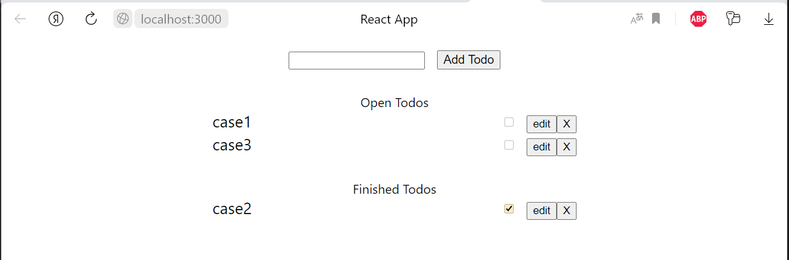
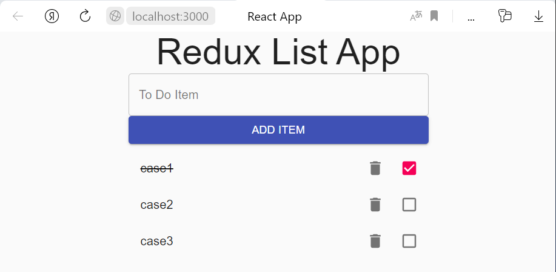

МИНИСТЕРСТВО НАУКИ И ВЫСШЕГО ОБРАЗОВАНИЯ

РОССИЙСКОЙ ФЕДЕРАЦИИ

ФЕДЕРАЛЬНОЕ ГОСУДАРСТВЕННОЕ БЮДЖЕТНОЕ ОБРАЗОВАТЕЛЬНОЕ УЧРЕЖДЕНИЕ ВЫСШЕГО ОБРАЗОВАНИЯ

«ВЯТСКИЙ ГОСУДАРСТВЕННЫЙ УНИВЕРСИТЕТ»

Институт математики и информационных систем

Факультет автоматики и вычислительной техники

Кафедра систем автоматизации управления
 
 
 
 

Дата сдачи на проверку:

«___» __________ 2022 г.

Проверено:

«___» __________ 2022 г.
 
 
 
 
 

Отчет по лабораторной работе № 6

по дисциплине

«Web-программирование»

 
 
 
 

Разработал студент гр. ИТб-2301-01-00 ________________ /Ведерников Д.М./

Проверил ст. преподаватель _________________ /Земцов М.А./

Работа защищена с оценкой «___________» «___» __________ 2022 г.

 
 
 
 

Киров 2022

Цель: сравнить менеджеры состояний (компонентов) для React на примере ToDo list.

Задачи:

1. Организовать процесс работы над лабораторной работой
1. Менеджер состояний Hooks (MobX)
1. Менеджер состояний Redux
1. Менеджер состояний Recoil
1. Сравнение менеджеров состояний 

Ход выполнения:

1. Организовать процесс работы над лабораторной работой

Для работы в репозитории *[ссылка на репозиторий](https://github.com/Dementoriy/Web)* на сайте github.com были созданы три новые ветки для каждого рассматриваемого менеджера состояний.

2. Менеджер состояний Hooks (MobX)

Hooks React позволяют, при работе с функциональными компонентами, пользоваться аналогом состояния компонентов, основанных на классах, и аналогами методов их жизненного цикла. Hooks появились в React 16.8.

Среди основных сильных сторон Hooks можно отметить следующие:

- Возможность использования состояния и обработки событий жизненного цикла компонентов без применения компонентов, основанных на классах.
- Совместное хранение связанной логики в одном и том же месте компонента вместо разбиения подобной логики между несколькими методами жизненного цикла.
- Совместное использование механизмов, независимых от реализации компонента.

В ходе лабораторной работы был изучен пример реализации приложения todo list. Приложение добавлено в git https://github.com/Dementoriy/Web/tree/lab6.1. Результат работы приложения представлен на рисунке 1.

Рисунок 1 – Todo list на Hooks (MobX)

3. Менеджер состояний Redux

Redux — это библиотека, реализующая предсказуемое хранилище состояния приложений. Это, кроме того, архитектура, которая легко интегрируется с React.

Основные сильные стороны Redux:

- Детерминированное представление состояния (в комбинации с чистыми компонентами это даёт возможность формирования детерминированных визуальных элементов).
- Поддержка транзакционных изменений состояния.
- Изоляция управления состоянием от механизмов ввода-вывода данных и побочных эффектов.
- Наличие единого источника достоверных данных для состояния.
- Лёгкая организация совместной работы с состоянием в различных компонентах.
- Средства анализа транзакций (автоматическое логирование объектов действий).
- Отладка с возможностью записи и воспроизведения процесса выполнения программы (Time Travel Debugging, TTD).

Другими словами, Redux позволяет хорошо организовывать код и позволяет удобно его отлаживать. Redux помогает разрабатывать приложения, которые легко поддерживать. Благодаря использованию этой библиотеки упрощается поиск истоков проблем, возникающих в программах.

Был рассмотрен пример реализации приложения todo list. Приложение добавлено в git https://github.com/Dementoriy/Web/tree/lab6.2. Результат работы приложения представлен на рисунке 2.

Рисунок 2 – Todo list на Redux

4. Менеджер состояний Recoil

Recoil располагает себя как библиотека, имеющая относительно малый размер, исключительно для React, что поможет решать проблемы в диапазоне данного фреймворка.

Сильные стороны Recoil:

- Высокая производительность.
- Относительно малый размер библиотеки.
- Удобство для пользователя.

В ходе работы был рассмотрен пример реализации приложения todo list. Приложение добавлено в git https://github.com/Dementoriy/Web/tree/lab6.3. Результат работы приложения представлен на рисунке 3.

Рисунок 3 – Todo list на Recoil

5. Сравнение менеджеров состояний 

Каждый менеджер состояния может заменить другой. При выборе того или другого стоит обратить внимание на объем проекта, удобства использования менеджера и скорость его работы.

Если проект состоит из одного визуального компонента, он не сохраняет данные в состояние и в нём не выполняются асинхронные операции ввода-вывода, то для такого проекта отлично подойдет Hooks. Если в проекте используются стандартные модели состояния компонентов React, то Hooks будет более удобен.

Применение возможностей Redux в компонентах может оказаться оправданным в том случае, если компоненты отличаются следующими особенностями:

- Они пользуются средствами ввода-вывода. Например — работают с сетью или с некими устройствами.
- Они сохраняют данные в состояние или загружают их из него.
- Они работают со своим состоянием совместно с компонентами, не являющимися их потомками.
- Они имеют дело с любой бизнес-логикой, с которой имеют дело и другие части приложения, либо — выполняют обработку данных, которые используются в других частях приложения.

Молодая библиотека Recoil может иметь смысл для огромных приложений, которые должны отображать большое количество компонентов на странице.

Вывод: в ходе выполнения лабораторной работы рассмотрены три менеджера состояний на примере реализации приложения ToDo list и выявлены их особенности. В результате исследования было выявлено, что наиболее оптимальным решениям является использование менеджера состояний Redux.